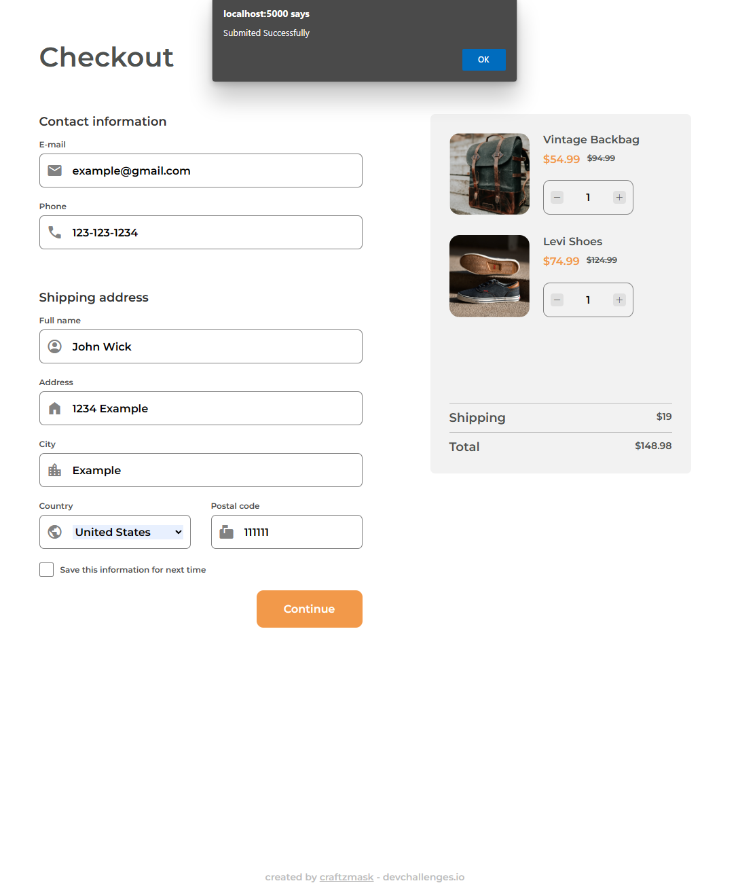

<!-- Please update value in the {}  -->

<h1 align="center">Checkout Page</h1>

<div align="center">
   Solution for a challenge from  <a href="http://devchallenges.io" target="_blank">Devchallenges.io</a>.
</div>

<div align="center">
  <h3>
    <a href="https://checkout-page-92729.web.app">
      Demo
    </a>
    <span> | </span>
    <a href="https://github.com/craftzmask/checkout-page">
      Solution
    </a>
    <span> | </span>
    <a href="https://devchallenges.io/challenges/0J1NxxGhOUYVqihwegfO">
      Challenge
    </a>
  </h3>
</div>

<!-- TABLE OF CONTENTS -->

## Table of Contents

- [Overview](#overview)
  - [Built With](#built-with)
- [Features](#features)
- [Contact](#contact)
- [Acknowledgements](#acknowledgements)

<!-- OVERVIEW -->

## Overview

#### Main Page


#### Dropdown Menu


#### Validation


#### Update Total


#### Mobile Page


Introduce your projects by taking a screenshot or a gif. Try to tell visitors a story about your project by answering:

- Where can I see your demo?
  - You can see it [here](https://checkout-page-92729.web.app).
- What was your experience?
  - Wrote JavaScript to handle number of items and calculate total took me a while to make it correct.
- What have you learned/improved?
  - Flex, CSS units and JavaScript.
- Your wisdom? :)
  - You get what you work for not what you wish for.

### Built With

<!-- This section should list any major frameworks that you built your project using. Here are a few examples.-->

- HTML
- CSS
- JavaScript

## Features

<!-- List the features of your application or follow the template. Don't share the figma file here :) -->

This application/site was created as a submission to a [DevChallenges](https://devchallenges.io/challenges) challenge. The [challenge](https://devchallenges.io/challenges/0J1NxxGhOUYVqihwegfO) was to build an application to complete the given user stories.
- [x] User story: I can see a page following [the given design](https://www.figma.com/file/4B0x88GhiZvgVlcQPSQ73D)
- [x] User story: I can input email, phone, full name, address, city, country, and postal code
- [x] User story: I can input the number of items
- [x] User story: I can select at least 3 countries from the dropdown
- [x] User story: When I click submit button or press enter, I can see a warning if validation fails
- [x] User story: When I click submit button or press enter, I can see a successful alert if validation succeeds

## How To Use

To clone and run this application, you'll need [Git](https://git-scm.com) and a browser such as [Google Chrome](https://www.google.com/chrome/) installed on your computer. From your command line:

```bash
# Clone this repository
$ git clone https://github.com/craftzmask/checkout-page
```

## Acknowledgements

<!-- This section should list any articles or add-ons/plugins that helps you to complete the project. This is optional but it will help you in the future. For exmpale -->

- [A Complete Guide to Flexbox](https://css-tricks.com/snippets/css/a-guide-to-flexbox/)
- [CSS values and units](https://developer.mozilla.org/en-US/docs/Learn/CSS/Building_blocks/Values_and_units)
- [How to Submit a Form with JavaScript – JS Submit Button Example](https://www.freecodecamp.org/news/how-to-submit-a-form-with-javascript/)

## Contact

- GitHub [craftzmask](https://github.com/craftzmask/)
